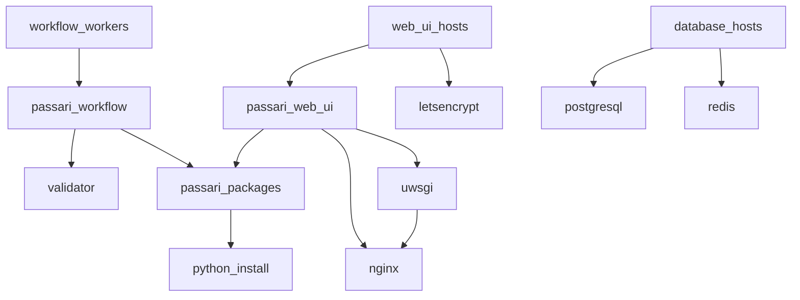

# Passari Ansible

Ansible playbooks to provision AlmaLinux 9 based hosts for system for
digital preservation with Passari.

To get started, install Ansible. On Fedora-based systems such
AlmaLinux, you can run:

    sudo yum install ansible

On Debian-based systems, you can run:

    sudo apt-get install ansible

You may also install Ansible using Python's Pip package manager and
utilize the provided `requirements.txt` file. Use a separate virtual
environment to avoid conflicts with system packages:

    python3 -m venv .venv
    source .venv/bin/activate
    pip install -r requirements.txt

After this, you can run the playbook by running:

    ansible-playbook -J site.yml

Adjust the host settings in `hosts` if needed. Configure the new hosts
as by making a copy of `group_vars/all` (file containing the default
settings) and editing it as necessary.

## Architecture

The Ansible playbooks are divided into roles which are used to provision
the hosts. The hosts belong to groups which define the roles that are
applied to them.

The host groups are:

- `workflow_workers`
- `web_ui_hosts`
- `database_hosts`

The roles are:

- `common`: Common packages and settings for all hosts
- `passari_workflow`: Passari Workflow Worker
- `passari_web_ui`: Passari Web User Interface
- `validator`: Installs software used in the SIP validation
- `passari_packages`: Installation packages for the Workflow and Web UI
- `python_install`: Provide another Python version (used for Passari)
- `nginx`: Nginx web server for serving the Web UI
- `uwsgi`: uWSGI application server for the Web UI
- `letsencrypt`: Let's Encrypt CertBot for renewing TLS certificates
- `postgresql`: PostgreSQL database for the web UI and Workflow
- `redis`: Redis key-value store for the Workflow Workers

The dependency tree of the host groups and roles is as follows. Note
that the `common` role is applied to all hosts, but it is not shown in
the graph.

